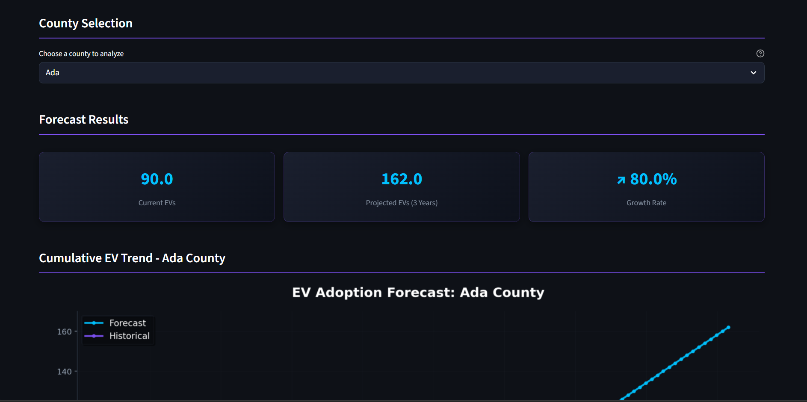

<div align="center">
  
  <h1>⚡ EV Charging Demand Prediction</h1>
  <p><em>A Data-Driven System to Forecast Electric Vehicle (EV) Charging Demand Across Washington State</em></p>
  
  <p>
    
    
    
    
    
  </p>
</div>

## 📌 Project Overview

**AICTE Shell-Edunet Skills4Future Internship Project**

Electric Vehicles (EVs) are revolutionizing transportation, but efficient charging infrastructure is essential for sustainable adoption. This project leverages historical EV registration data to build a predictive model for forecasting adoption trends across Washington State counties.



## ✨ Key Features

- **County-Level Forecasting**: Predict EV adoption for any Washington State county
- **Interactive Dashboard**: Beautiful Streamlit interface with dark theme
- **3-Year Projections**: Visualize growth trends with historical context
- **Multi-County Comparison**: Analyze regional adoption patterns
- **Machine Learning Model**: RandomForest-based forecasting engine

## 🛠️ Tech Stack

| Component           | Technology                          |
|---------------------|-------------------------------------|
| Core Language       | Python 3.10                         |
| Data Processing     | pandas, numpy                       |
| Visualization       | matplotlib, Plotly                  |
| ML Framework        | scikit-learn (RandomForestRegressor)|
| Web Framework       | Streamlit                           |
| Deployment          | Render (via Procfile)               |

## 📂 Project Structure
```
EV-vehicle-demand-prediction/
├── assets/
│ ├── car.png
│ └── ev-car-factory.jpg
├── data/
│ ├── EV_Population_By_County.csv
│ └── preprocessed_ev_data.csv
├── notebook/
│ └── EV_DemandPrediction.ipynb
├── app.py
├── forecasting_ev_model.pkl
├── requirements.txt
├── runtime.txt
├── Procfile
├── LICENSE
└── README.md
```

## 🚀 Deployment Status

[](https://ev-demand-forecast.onrender.com)

<!-- [](https://ev-demand-forecast.onrender.com) -->

Deployed live on Render: [https://ev-demand-forecast.onrender.com](https://ev-demand-forecast.onrender.com)

## 💻 Local Setup
Follow these instructions to set up the project locally.

```bash
git clone https://github.com/XynaxDev/EV-vehicle-demand-prediction.git
cd EV-vehicle-demand-prediction
pip install -r requirements.txt
streamlit run app.py
```

## 📄 License

This project is licensed under the [MIT License](LICENSE).

## 🙏 Acknowledgements

- AICTE & Shell Edunet Skills4Future Internship Program
- Inspired by best practices from real-world EV infrastructure projects.

<br>
<br>
<div align="center"> Made with 💌 and Streamlit by Akash | © 2025 AICTE Internship Project </div>